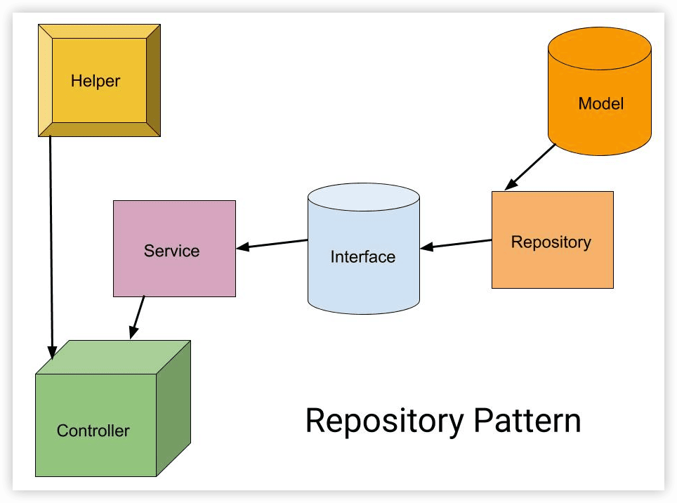

薪酬系统
----

https://laravelacademy.org/books/test-driven-apis-with-laravel

简单的薪资系统CRM，以测试驱动API开发

### 1 CRM API整体设计

CRM 系统主要包含三个功能模块：

- 部门
- 员工（国外分工薪员工和小时工，其中工薪员工按年薪/12每月发放，小时工按工作日志统计的时长*时薪每月发送）
- 支付

#### 用户故事

任何项目/需求开始写代码之前，都要经过整体技术方案设计，以及涉及到的技术栈的调研和准备工作，让编码工作在预设方案内执行，而不是想到什么写什么，让研发流程变成一团乱麻，最后失控。对于大型项目，目前比较流行通过领域驱动设计进行架构设计，对于本项目，由于比较简单，我们可以简化流程，但是必要的设计也是不可或缺的。

我们将从用户故事出发，将用户故事转化为业务需求：

| 名称         | 描述                                                         |
| ------------ | ------------------------------------------------------------ |
| 创建部门     | 用户可以通过名称和描述信息创建一个新的部门                   |
| 更新部门     | 用户可以更新已存在的部门信息                                 |
| 获取部门列表 | 用户可以查看所有部门列表                                     |
| 查看部门详情 | 用户可以查看指定部门详情，在部门详情页可以展示该部门下的所有员工 |
|              |                                                              |
| 创建员工     | 用户可以创建新员工                                           |
| 更新员工     | 用户可以更新已存在的员工                                     |
| 获取员工列表 | 用户可以查看所有员工列表，并进行筛选                         |
| 查看员工详情 | 用户可以查看指定员工详情，需要列出该员工所有薪资支付记录     |
| 删除员工     | 用户可以删除员工，同时删除关联的支付记录和工作时长日志（小时工） |
|              |                                                              |
| 支付日支付   | 在每月支付日为每个员工进行薪资校验、支付薪资（以创建薪资支票方式） |

这里面的核心业务逻辑是薪资支付：

- 每个员工根据类型有不同的支付方式，工薪员工按年薪/12发放，小时工按工作时长*时薪发放（按月支付）
- 小时工会关联工作时长日志，用于统计工作时长
- 在每月的支付日，我们需要为每个员工核验计算正确的薪资金额，创建对应的薪资支票（也就是发放工资）

#### 数据库设计

对于这个简单的项目，不需要搞什么领域划分、领域模型了，基于上面的业务需求和功能模块，直接设计底层数据库就好了，在小型项目中，数据模型和领域模型是一体的，不同数据模型的属性、关联关系如下所示：

```yaml
department:
  description: It holds information about a department inside a company
  attributes:
    - name
    - description
  relationships:
    - employees: A department has many employees
    - paychecks: A department has many paychecks through employees

employee:
  description: It holds information about an employee and his / her salary
  attributes:
    - full_name
    - email
    - department_id
    - job_title
    - payment_type:
        - salary
        - hourly_rate
    - salary: Only if payment_type is salary
    - hourly_rate: Only if payment_type is hourly_rate
  relationships:
    - department: An employee belongs to a department
    - paychecks: An employee has many paychecks
    - time_logs: An employee has many time_logs

paycheck:
  description: It holds information about an employee paycheck
  attributes:
    - employee_id
    - net_amount
    - payed_at
  relationships:
    - employee: A paycheck belongs to an employee

time_logs:
  description: Time tracked by an employee
  attributes:
    - employee_id
    - started_at
    - stopped_at
    - minutes
  relationships:
    - employee: A time_log belongs to an employee
```

#### 代码设计

这个系统虽然不复杂，但仍然有一些值得设计的地方：

- 浮点数处理优化：薪水（精确到分）、时间（分钟）可以通过调整单位将浮点数转化为整型处理，避免浮点数精度问题，这里可以引入值对象进行处理
- 两种支付类型的支付处理：可以引入枚举、工厂、策略模式让代码更优雅，扩展性和复用性更好
- 时间字段遵循 Laravel 默认设置 `xxx_at`，看起来更贴近实际语义

#### API 设计

每个用户故事都可以转化为一个对应的 API 接口：

```sh
POST /departments                                 # 新建部门
PUT /departments                                  # 更新部门
GET /departments                                  # 获取部门列表
GET /departments/{department}                     # 获取指定部门
GET /departments/{department}/employees           # 获取指定部门下的所有员工

POST /employees                                   # 新建员工
PUT /employees                                    # 更新员工
GET /employees                                    # 获取员工列表
GET /employees/{employee}                         # 获取指定员工
DELETE /employees/{employee}                      # 删除指定员工
GET /employees/{employee}/payhecks                # 获取指定员工支付记录

POST /payday                                      # 创建支付日检查、薪资支付
```

#### 测试框架

将使用 [Pest](https://pestphp.com/) 替代默认的 [PHPUnit](https://phpunit.de/)。对比

```php
/** @test */
public function it_should_return_an_employee()
{
    $employee = $this->getJson(route('emplyoees'))->json('data');
    
    $this->assertEquals('John Doe', $employee['name']);
    $this->assertEquals('salary', $employee['payment']['type']);
    $this->assertEquals('$50,000', $employee['payment']['amount']['dollars']);
}
```

Pest 测试:

```php
it('should return an employee', function () {
    $employee = getJson(route('emplyoees'))->json('data');
    
    expect($employee)
        ->name->toBe('John Doe')
        ->payment->type->toBe('salary')
        ->payment->amount->dollars->toBe('$50,000');
});
```

相比 PHPUnit 这种传统的单元测试代码风格，Pest 的链式调用使用起来更直观，更贴近行为驱动测试，更重要的，它可以和用户故事紧密结合，很自然的完成所有用户故事的验收，让团队除开发人员以外的更多人参与到测试验收环节中。


> 简而言之，`laravel-shift/blueprint` 是一个代码生成工具，用于自动化生成 Laravel 应用程序的多个组件，而 `\Illuminate\Database\Schema\Blueprint` 是 Laravel 内置的一个类，用于在数据库迁移中定义数据库表的结构。两者都与 Laravel 应用程序的构建有关，但它们的应用场景和具体功能是不同的。


#### 关于DDD

现在很多中大型项目都流行通过领域驱动设计（Domain-Driven Design，简称DDD）完成架构设计，对于这个小项目，不需要那么重的设计，但是也可以把一些好的 DDD 理念引入进来，锦上添花：

- Value Objects（值对象）: 通过封装到对象来处理标量数据，让标量数据从单一的数值演进到具备更多行为，例如，我们可以将金额值封装为一个 Money 对象，这样就可以提供行为方法将金额转化为不同单位币种的字符串展示格式了。
- ==Data Transfer Objects(DTO)==: PHP成也数组，败也数组，在大型项目中，所有方法参数、返回值都是数组类型的话维护起来是灾难性的，你永远不知道这些非结构化的参数、返回值里面具体包含什么数据，你一定很熟悉那些 `undefined index` 报错吧。为此，我们可以通过把关联数组转化为 DTO 对象，从而方便处理关联数组表示的参数、返回值，让代码语义性更好，维护起来也更省心。
- Actions: 这个不是 DDD 中的概念，实际上是 Laravel 提供的一个特性，我们可以**将所有用户故事表示为独立可复用的类**，封装到 Action 中，这是一种==单一职责==的设计原则体现，也是避免“胖服务”的有效方式。


### 2 项目初始化


```sh
composer create-project laravel/laravel ARPayroll  10.x
```


`.env`配置数据库


安装 JSON:API Resource 和 Laravel Query Builder 两个扩展包

```sh
composer require timacdonald/json-api:'v1.*'

composer require spatie/laravel-query-builder
php artisan vendor:publish --provider="Spatie\QueryBuilder\QueryBuilderServiceProvider" --tag="query-builder-config"
```

#### Blueprint

使用第三方扩展包 [Blueprint ](https://github.com/laravel-shift/blueprint)通过配置文件快速完成 Laravel 数据库迁移、模型类、工厂类等组件的编排和创建：

```sh
composer require --dev laravel-shift/blueprint
```

发布配置文件 `draft.yaml` 到项目根目录：

```sh
php artisan blueprint:new --config
```

在 `draft.yaml` 中编写模型、模型字段属性以及模型之间的关联：

```yaml
models:
  Department:
    uuid: uuid
    name: string:50
    description: longtext
    relationships:
      hasMany: Employee
  Employee:
    uuid: uuid
    full_name: string:100
    email: string:100 index
    department_id: id foreign
    job_title: string:50
    payment_type: string:20
    salary: integer unsigned nullable
    hourly_rate: integer unsigned nullable
    relationships:
      hasMany: Paycheck, Timelog
  Paycheck:
    uuid: uuid
    employee_id: id foreign
    net_amount: integer unsigned nullable
    payed_at: timestamp nullable
    relationships:
      belongsTo: Employee
  TimeLog:
    uuid: uuid
    employee_id: id foreign
    started_at: timestamp nullable
    stopped_at: timestamp nullable
    minutes: integer unsigned nullable
    relationships:
      hasMany: Employee
```


生成对应的模型类、数据库迁移以及模型工厂：

```sh
php artisan blueprint:build
```

基于数据库迁移文件在数据库中创建对应的数据表:

```sh
php artisan migrate
```


> 通过Blueprint这个扩展包来管理数据模型相关的类和文件还是很方便的，甚至还可以通过它生成控制器、表单请求、视图模板、路由、任务、事件等组件（需要额外配置），它的配置文件 `draft.yaml` 就像项目蓝图，你可以根据它快速生成 Laravel 项目运行所需的组件。

#### API 版本

不同版本的请求地址类似：

```
/api/v1/employees
/api/v2/employees
```

针对不同版本 API 新建对应的路由文件管理相关路由：

```
routes/api/v1.php
routes/api/v2.php
```

在 `app/Providers/RouteServiceProvider.php` 中通过路由前缀+版本文件提供对API版本的支持和管理：

```php
public function boot()
{
    // ...

    $this->routes(function () {
        Route::middleware(['api', 'auth:sanctum'])
            ->prefix('api/v1')
            ->group(base_path('routes/api/v1.php'));

        Route::middleware(['api', 'auth:sanctum'])
            ->prefix('api/v2')
            ->group(base_path('routes/api/v2.php'));
    });
}
```


#### UUID

API 不要对外暴露自增 ID，而要使用 UUID，两者的适用场景如下：

- API 层使用 UUID
- 业务逻辑层使用ID（主要是数据库查询场景）

```sh
composer require ramsey/uuid
```

定义一个可以被所有模型类复用的 Trait，让需要UUID的模型在创建的时候自动生成UUID。

```php
<?php

namespace App\Models\Concerns;

use Illuminate\Database\Eloquent\Model;
use Ramsey\Uuid\Uuid;

/**
 * 用于需要UUID字段的模型
 */
trait HasUuid
{
    public static function bootHasUuid(): void
    {
        Model::creating(function (Model $model) {
            $model->uuid = Uuid::uuid4()->toString();
        });
    }
}
```


#### 配置 Pest

```sh
composer require pestphp/pest --dev --with-all-dependencies
composer require pestphp/pest-plugin-laravel --dev
php artisan pest:install
```

> 🔖 问题：
>
> ```
>  php artisan pest:install
> 
>    ERROR  Command "pest:install" is not defined. Did you mean one of these?  
> 
>   ⇂ migrate:install  
>   ⇂ pest:dataset  
>   ⇂ pest:test  
>   ⇂ sail:inst
> ```
>
> 


### 3 部门API开发


#### 3.1 创建部门

##### 测试用例

```sh
php artisan pest:test CreateDepartmentTest
```


```
./vendor/bin/pest


./vendor/bin/pest tests/Feature/CreateDepartmentTest.php
```


##### 业务代码

DDD的概念来让代码复用性更好、结构更清晰、更具备可读性。

在DDD中，**用户请求数据**会被封装到**==DTO对象==**（Data Transfer Object）统一结构化，然后传递给领域层。这里在`app/DTOs`目录下新建一个DTO类`DepartmentData`来封装新建部门的请求数据：

```php
<?php

namespace App\DTOs;

class DepartmentData
{
    public function __construct(
        public readonly string $name,
        public readonly ?string $description
    ) {}
}
```

我们不会创建单独的 Service 来处理业务逻辑，因为和传统 MVC 模式容易导致胖模型一样，Service 也很容易膨胀为胖服务，为了解决这个问题，在 Laravel 中可以创建 Action 以单一职责模式处理单个用户故事，Action 可以被**控制器、队列任务、命令行**等多种入口调用，从而提高了代码复用性。这里我们在 `app/Actions` 目录下新建一个 `CreateDepartmentAction.php`，然后在 Action 类中定义一个 `execute` 方法处理实际业务逻辑 —— 新建部门，`CreateDepartmentAction` 接收部门 DTO 对象作为参数，返回 `Department` 模型类实例：

```php
class CreateDepartmentAction
{
    // 处理实际业务逻辑：新建部门
    public function execute(DepartmentData $departmentData): Department
    {
        return Department::create([
           'name' => $departmentData->name,
            'description' => $departmentData->description,
        ]);
    }
}
```


新建了一个专门**处理新建部门的==表单请求类==** `StoreDepartmentRequest` 用于对请求数据进行验证：

```sh
php artisan make:request StoreDepartmentRequest
```


创建一个**API Resource类** `DepartmentResource` 来封装响应的 JSON 数据（先通过自带的处理，后面再重构优化）：

```sh
php artisan make:resource DepartmentResource
```


新建一个资源控制器 `DepartmentController` ，在 `store` 方法中把以上操作都串起来（编排），形成一个完整的新建部门功能，包括**==表单请求验证、DTO对象转化、Action调用、响应数据包装及返回==**：【`StoreDepartmentRequest`,`DepartmentData`,`CreateDepartmentAction`,`DepartmentResource`】

```sh
php artisan make:controller DepartmentController --resource
```

```php
class DepartmentController extends Controller
{
    public function __construct(
        public readonly CreateDepartmentAction $createDepartment,
        public readonly UpdateDepartmentAction $updateDepartment
    ) {}

    public function store(StoreDepartmentRequest $request)
    {
        $departmentData = new DepartmentData(...$request->validated()); // TODO
        $department = $this->createDepartment->execute($departmentData);
        return DepartmentResource::make($department)->response();
    }
  	...
}
```


添加路由

```php
Route::apiResource('departments', DepartmentController::class);
```


```sh
./vendor/bin/pest tests/Feature/CreateDepartmentTest.php
```


#### 3.2 更新部门

##### 测试用例

```sh
php artisan pest:test UpdateDepartmentTest
```


##### 业务代码

```sh
php artisan make:request UpdateDepartmentRequest
```


```sh
./vendor/bin/pest tests/Feature/UpdateDepartmentTest.php 
```


#### 3.3 获取部门


#### 3.4 关联资源


### 4 员工API开发（上）

#### 4.1 支付类型

员工按照工资支付方式分为两种类型：

- 工薪制：每月支付日，按年薪/12发放薪资给员工
- 小时工：每月支付日，按工作时长（小时）x时薪发放薪资给员工


#### 4.2 创建/更新员工


```sh
// Upsert = updte + insert
php artisan pest:test UpsertDepartmentTest
```


```sh
php artisan make:request UpsertEmployeeRequest
```


#### 4.3 创建/更新员工用例

##### 表单请求验证

##### 创建/更新员工用例


##### Employee DTO

在DDD中，一般会通过DTO对请求数据进行封装后传递给领域层，然后在领域层处理完毕后，将结果再转化为DTO的数据格式返回。这样做的一个好处是统一结构化用户请求参数，以及屏蔽领域层的数据结构细节。

在 PHP 里面，一个经常被诟病的问题就是各种请求参数都用数组表示，你永远不知道传入的参数中到底包含什么数据，这给系统维护和迭代带来巨大困扰，尤其是中大型系统，同时也成了很多线上问题的重灾区，我们可以引入 DTO 来规范和解决这个问题，以员工请求数据为例，我们可以创建一个名为 `EmployeeData` 的 DTO 类来装载员工表单数据。

```php
<?php

namespace App\DTOs;

use App\Http\Requests\UpsertEmployeeRequest;
use App\Models\Department;

class EmployeeData
{
    public function __construct(
        public readonly string $fullName,
        public readonly string $email,
        public readonly Department $department,
        public readonly string $jobTitle,
        public readonly string $paymentType,
        public readonly ?int $salary,
        public readonly ?int $hourlyRate,
    ) {}

    public static function fromRequest(UpsertEmployeeRequest $request): self
    {
        return new static(
            $request->fullName,
            $request->email,
            $request->getDepartment(),
            $request->jobTitle,
            $request->paymentType,
            $request->salary,
            $request->hourlyRate,
        );
    }
}
```

在这个 DTO 中，需要定义一个 `fromRequest` 方法将请求字段和 DTO 属性做一一映射，虽然增加了代码量，但是却为日后的系统维护打下了良好的基础。


##### UpsertEmployeeAction

传统 [MVC 模式](https://laravelacademy.org/post/9614#toc-0) 是一种分层架构，在实际业务开发中，会面临业务逻辑应该放在哪里的困扰，如果放到控制器里面会导致控制器的臃肿，如果放到模型类里面会造成模型类的臃肿（胖模型），而且如果是与数据库无关的业务逻辑也不适合放到模型类。

经过这么多年的工程实践和演化，也推出了很多新的架构模式，比如独立出一个服务层，把控制器里的业务逻辑都放到 Service 面，让控制器瘦身，同时也提高了代码的复用性，服务不仅可以被控制器调用，也可以被命令行、消息队列调用，这也是目前很多公司的架构模式，而在模型类之上又添加一个[仓储模式](https://laravelacademy.org/post/3053.html)，专门负责与数据库的交互，以让模型类瘦身：



> DDD 和微服务已经把这一套玩的很熟了，有很成熟的架构模式。


##### Employee Resource

使用 JSON:API Resourse 扩展包来保证 API 接口返回的数据是遵循 JSON API 规范的，因此需要创建一个继承自 `TiMacDonald\JsonApi\JsonApiResource` 的 `EmployeeResource`，然后编写属性转化方法。

##### Employee Controller


```sh
php artisan make:controller EmployeeController --resource
```

##### 让测试用例通过


### 5 员工API开发（下）

#### 5.1 获取员工列表

```sh
# 返回邮箱中包含 john@example.com 的所有员工
GET /api/v1/employees?filter[email]=john@example.com

# 返回姓名中包含 freek & 职位中包含 developer 的所有员工
GET /api/v1/employees?filter[full_name]=freek&filter[job_title]=developer

# 返回部门名称中包含 development 的所有员工
GET /api/v1/employees?filter[department.name]=development

# 返回员工时包含部门信息，避免 N+1 查询问题
GET /api/v1/employees?include=department
```


##### 测试用例

创建测试文件：

```sh
php artisan pest:test GetEmployeesTest
```


##### 业务代码


#### 5.2 资源和值对象

使用值对象的方式对薪资金额的数据格式进行优化。

所谓==值对象==，就是封装了基本标量数据（整型、浮点型、字符串、布尔类型等）的低级类。


值对象的特点：

- 不可变，属性值只读，不提供setter
- 不包含任何标志性属性，如ID（这也是值对象与实体的主要区别）

在应用代码中，通常可以将地址、邮箱、数字等标量数据转化为值对象进行处理。**通过使用值对象，可以从内聚的标量数据中创建对象**，因此，使用值对象有如下优点：

- 让代码更高级
- 澄清事实避免混淆（通过代码可以直观看出这个值的用途）
- 可以封装对空值的处理

其实涉及到数据处理的操作在业务系统多个地方都会用到，值对象通常应用在应用内部，而在应用边界，通常使用数据转换对象（DTO）。

### 6 支付API开发


```sh
php artisan pest:test PaycheckTest
```

#### 6.1 创建薪资支票

##### 为工薪员工创建薪资支票


##### 为时薪员工创建薪资支票


#### 6.2 获取员工薪资记录

```sh
GET /api/v1/employees/[uuid]/paychecks
```


```sh
php artisan pest:test GetEmployeePaychecksTest
```


>http://127.0.0.1:8000/api/v1/employees/15568dc2-44f1-b3a0-a81f-2f3776c12599/paychecks
>
>


bugs

http://127.0.0.1:8000/api/v1/departments/15/employees

http://127.0.0.1:8000/api/v1/departments
